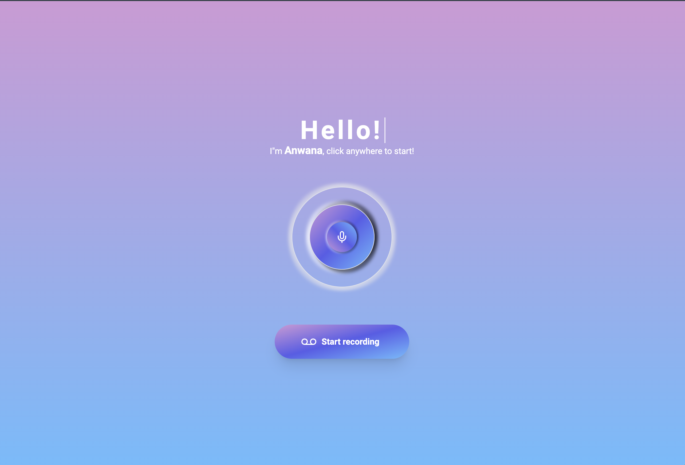

# Anwana

Anwana is a voice assistant that is trained on Nigerian public knowledge and can answer questions that can help the average Nigerian live a more filled life.



## Getting Started

1. Clone the repo:

```sh
> git clone git@github.com:lawalbolaji/anwana.git
```

2. In the project's root directory, run:

```sh
> cp .env.example .env.local
```

3. Create OpenAI credentials here and add those credentials to your .env.local file

4. Install NodeJs dependencies:

```sh
> npm ci
```

5. Boot up:

```sh
> npm run dev
```

Open [http://localhost:3000](http://localhost:3000) with your browser to see the result.
